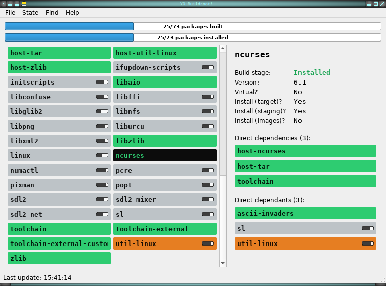

// Render with Asciidoctor

= YO Buildroot!
Philippe Proulx <https://eepp.ca/>
:toc:

image:https://img.shields.io/pypi/v/yobr.svg?label=Latest%20version[link="https://pypi.python.org/pypi/yobr"]

YO Buildroot, what's up?

_**yobr**_ is a graphical https://buildroot.org/[Buildroot] build
monitor:

== Installation

. Make sure you have Python{nbsp}3 and
  Qt{nbsp}5 (_core_, _gui_, and _widgets_ modules)

. Install yobr from https://pypi.org/[PyPI]:
+
----
$ sudo pip3 install yobr
----

== Usage

The installed `yobr` program accepts two positional arguments:

----
$ yobr BR-ROOT-DIR [BR-BUILD-DIR]
----

`__BR-ROOT-DIR__` (mandatory)::
    Buildroot's root directory (where to find its main `Makefile`).

`__BR-BUILD-DIR__` (optional)::
    Buildroot's build directory, where all the package build directories
    are.
+
This directory does _not_ need to exist when you start yobr.
+
Default: `__BR-ROOT-DIR__/output/build`.

yobr only works with Buildroot{nbsp}≥{nbsp}2019.08.

yobr can take many seconds to start because it executes

----
$ make -s --no-print-directory show-info
----

to get information about the configured packages.

Once started, what you see is:

Global build and installed status progress bar (top)::
    The current number of _built_ and _installed_ packages (target and
    host).

Package build states::
    The individual build states of each package.
+
Each package build state has:
+
* The package's name.
* A backgroud colour which indicates the package build stage.
+
Click **Help** and then **Build stage legend** to see the stage-colour
mapping.

* A tiny progress bar which shows how many of its _direct_ dependencies
  (including itself) are currently _built_.
+
This progress bar is hidden as soon as the package is built.

+
Click a package build state to select it, showing its details on the
right.

Package build state details (right)::
    The details of a given package build state (when you select it).
+
The details include the selected package build state's build stage, its
version, and a list of package build states for each of its _direct_
dependencies.
+
Click a dependency package build state to select it globally.

yobr periodically (every two seconds by default) checks the existence of
package build stamp files to update its window. Click **State** to
change the refresh rate. The status bar shows the last update time.

== Credits

`yobr/icon.png` made by
https://www.flaticon.com/authors/srip[srip] from
https://www.flaticon.com/[www.flaticon.com].
